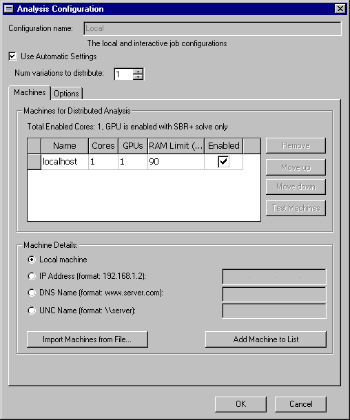
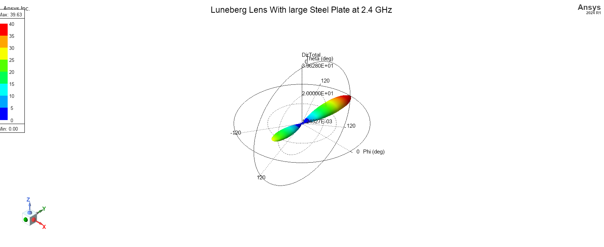

# AACP:

This github repository contains the necessary [HFSS](https://www.ansys.com/products/electronics/ansys-hfss) designs for the Lüneberg lens numerical calculations. It is provided as accompaniment to the master's thesis, ["aacp.pdf"](https://nam02.safelinks.protection.outlook.com/?url=https%3A%2F%2Fdigitalrepository.unm.edu%2Fece_etds%2F712&data=05%7C02%7Ckeithhbova%40unm.edu%7C152c158d0b9a4773157908ddace50ec9%7C25aa9830e0f9482b897e1a3b3c855e5c%7C0%7C0%7C638856821989524192%7CUnknown%7CTWFpbGZsb3d8eyJFbXB0eU1hcGkiOnRydWUsIlYiOiIwLjAuMDAwMCIsIlAiOiJXaW4zMiIsIkFOIjoiTWFpbCIsIldUIjoyfQ%3D%3D%7C0%7C%7C%7C&sdata=d9kI9K%2BxiximyHvMHBN6T0uJ%2BhJ9RlopcBm29xiVsAY%3D&reserved=0). The thesis depends on [PyEms](https://github.com/matthuszagh/pyems), [NaluCFD](https://github.com/NaluCFD/Nalu) and [Kokkos Kernels](https://github.com/kokkos/kokkos-kernels), among many other open source libraries. 

## Instructions:

- Load the file  ["lens\_with\_plate\_old.aedt"](https://github.com/keixthb/aacp/blob/main/HFSSFiles/lens_with_plate_old.aedt) with Ansys HFSS

- Select the ``HPC Options`` tab and configure so it is set to run all frequency iterations in a single core. This should look similar to the following:

- Click the ``Analyze All`` button. Using a stopwatch or timer, measure the time it takes to compute all 9 frequency steps from start to finish. 

- Validate that the directivity at 2.4GHz is 39.63 dB and has a consistent radiation pattern with the results below:

## Results:

You can compare your performance with a few different processors:

